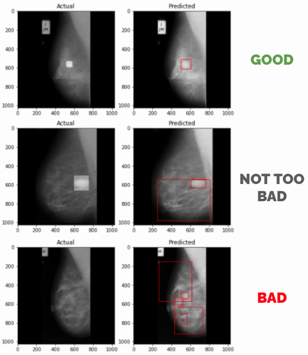
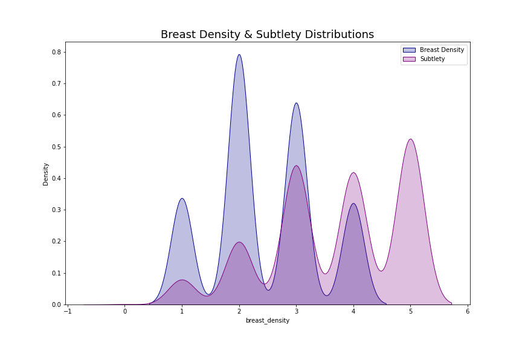
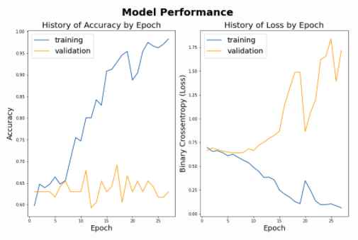
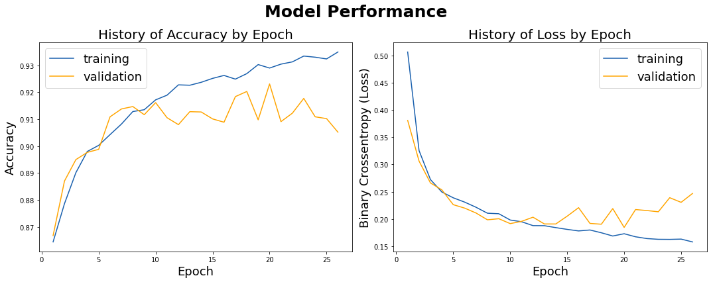

# Classifying Tumors in Mammograms

## Problem Statement

Breast Cancer is the second leading cause of death in women around the globe. Early detection through routine mammograms is the best prevention in improving Breast Cancer outcomes. 

For this project, we used 2 different mammogram datasets of differing sizes and built various neural network models in order to classify Tumors vs. No Tumors in mammogram images. Manual visual analysis of these images can be time consuming and subjective. This model aims to be used as a supplementary detection method for use by radiologists and oncologists.

## Executive Summary

## Project Workflow

### Data Sourcing, Cleaning & EDA

#### MIAS Dataset
[Link MIAS EDA Notebook]

#### DDSM Datasets
[Link DDSM EDA Notebook]

### Modeling & Analysis
#### MIAS Modeling
[Part 1B - MIAS Base CNN Modeling.ipynb]
[Link MIAS Mask RCNN Modeling Notebook]

#### DDSM Modeling
[Link DDSM Modeling Notebook]

Beat Baseline with 92-93% accuracy on Test and Validation datasets

## Conclusions & Recommendations
- Using ML for tumor/no tumor image classification is a useful approach, however, it is not without its challenges!
- Larger training datasets improve accuracy and reduce overfitting
- Be careful of data leakage! Always do your train test split before any image augmentation. 
- With more time and further learning, there are a few more  image processing techniques and ML models to try in taking this work further.

## References
1. MIAS Data Source: http://peipa.essex.ac.uk/info/mias.html
2. DDSM Data Source: https://www.kaggle.com/skooch/ddsm-mammography
3. CBIS-DDSM Data Source (EDA): https://wiki.cancerimagingarchive.net/display/Public/CBIS-DDSM
3. https://www.kaggle.com/kmader/mias-mammography
4. https://www.ncbi.nlm.nih.gov/pmc/articles/PMC5954872/
5. https://pubmed.ncbi.nlm.nih.gov/24209932/
6. https://core.ac.uk/download/pdf/21748057.pdf
7. https://www.nature.com/articles/sdata2017177
